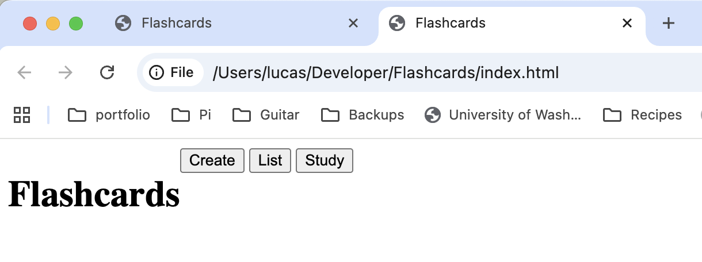

First we will make an index file to place our app in. Call this file index.html and let's start with the code that vs code autofills when you type !.
```
<!DOCTYPE html>
<html lang="en">
<head>
    <meta charset="UTF-8">
    <meta name="viewport" content="width=device-width, initial-scale=1.0">
    <title>Document</title>
</head>
<body>
    
</body>
</html>
```

Now lets change the document title to ```Flashcards```. We will also add a nav bar into the body of the page:
```
<body>
    <header>
        <h1>Flashcards</h1>
        <nav>
            <button data-view="create">Create</button>
            <button data-view="list">List</button>
            <button data-view="study">Study</button>
        </nav>
    </header>
</body>
```
Now if we go into the file explorer and open our file it should look something like this:

As you can see this isn't what a navigation bar (nav bar) normally looks like. Let's add some styles...

First, we will add a stylesheet. You should remember how to add this file and link it to our html file but I will walk you through it nonetheless. First make a new file called ```style.css``` by clicking the button that looks like a piece of paper with a plus sign. Then go to the ```index.html``` file and add the following as the last line of the head tag:
```
<link rel="stylesheet" href="style.css">
```

So the top of you file should look like:
```
<!DOCTYPE html>
<html lang="en">
<head>
    <meta charset="UTF-8">
    <meta name="viewport" content="width=device-width, initial-scale=1.0">
    <title>Flashcards</title>
    <link rel="stylesheet" href="style.css">
</head>
```
Now let's look at our ```styles.css``` file. It should just be blank. We can start by adding a flex box to our nav bar this will tell the computer that we want to fit ever
ything on one line (make our nav bar a bar instead of whatever it is now [a page I guess]). 

```
header {
    display: flex;
}
```

Now let's open this again and see what it looks like or, if you still have it open hit the refresh button:


Okay now that we have it refreshed it should look something like this:



That's more like it but normally in nav bars the title is on one side and the buttons on the other. We can use justify content to change how this looks:
```
header {
    display: flex;
    justify-content: space-around;
}
```

