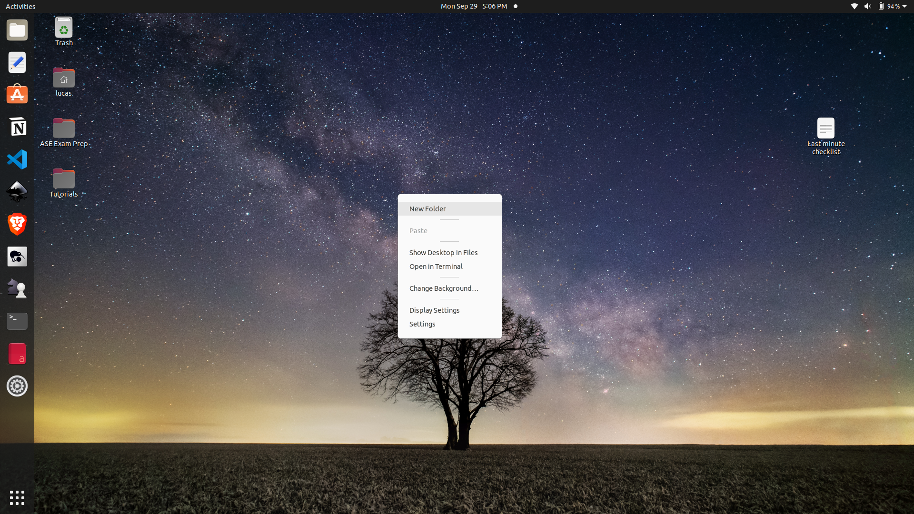
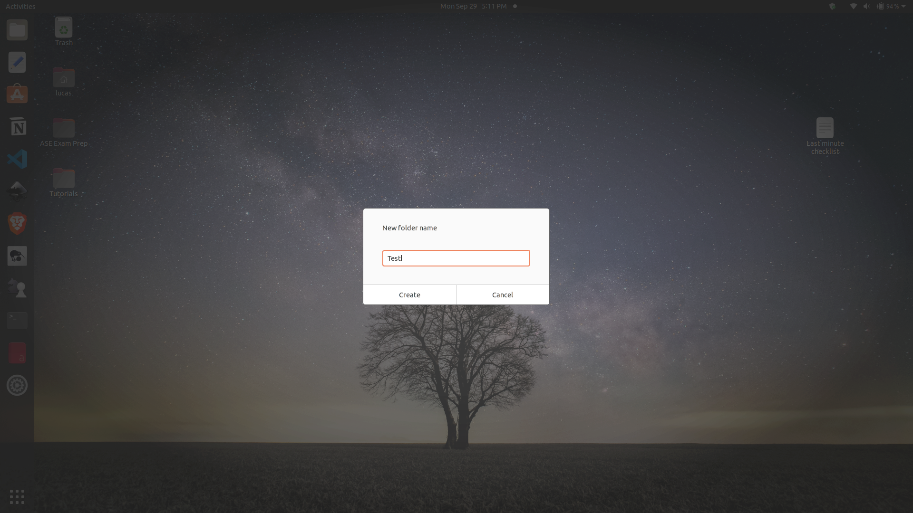

First let's make a folder on the desktop for storing our files in. Do this by right clicking on the desktop. This is done using one of the buttons by the trackpad where you move the mouse around. 


Then place your mouse over new folder and click. This will bring up a window like this: 

Name the folder test and then we will open visual studio code:


Click on the icon that looks like a blue ribbon.

Next let's open the folder: 

This will bring up the window where we choose  the folder. Choose desktop then the folder test.

Then we will create a new file in the folder. Click the button that looks like a sheet of paper with a plus sign. Then call the file: ```test.html```

Now in the file lets write the following:
```
<h1>Hello World</h1>
```

Now finally hit the button on the top right that looks like an _

And then double click on the folder on your desktop:

 
 and then this will bring up a window and you can double click on the file ```test.html```

 This will bring up the browser so we can look at the file. It should say in big letters Hello World. Thanks for following along!
