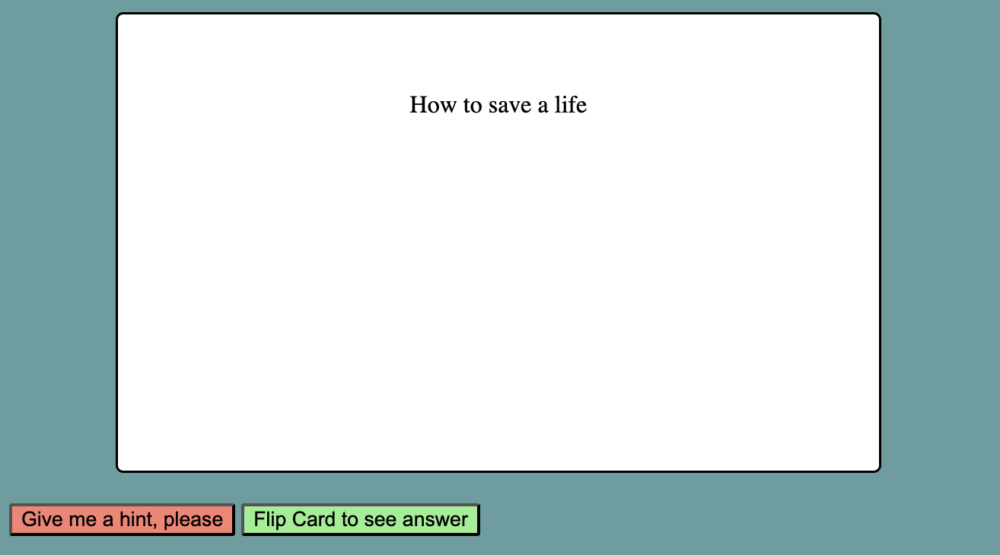
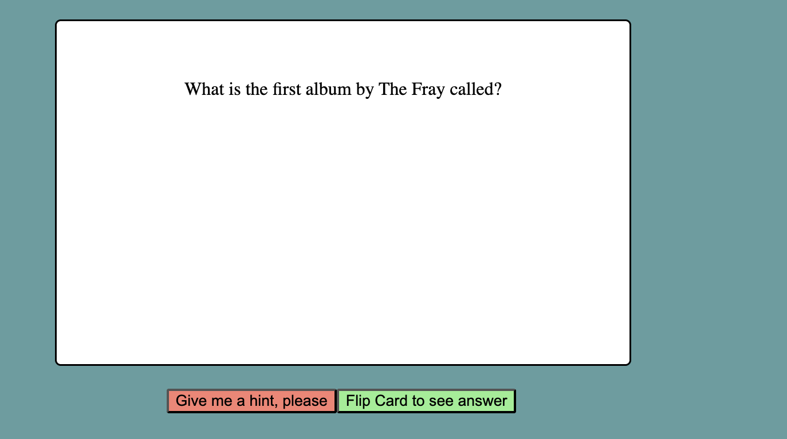

Before doing this tutorial you should have done the tutorials Html & Css Intro and watched the intro to Visual Studio Code. If your confused you can search for help on stack overflow or ask ollama. For this tutorial we will use a GUI based text editor visual studio. This should be a bit more user friendly than nano but you can use any text editor that you like. If you get lost with how to do something you can use the help menu at the top of the window. With time you will learn what is the best place to look for help.

Okay lets click on VS code and create a new file called ```Flashcard.html```. Then in this file we will place the header by typing ```!``` and then hit the tab key to auto fill the header. Now let's fill in the title so it looks something like this:
```
<!DOCTYPE html>
<html lang="en">
<head>
    <meta charset="UTF-8">
    <meta name="viewport" content="width=device-width, initial-scale=1.0">
    <link rel="stylesheet" href="Flashcard.css">
    <title>Flashcard</title>
</head>
<body>
    
</body>
</html>
```

Next lets make a paragraph; label it with the id Flashcard; and write our question "What is the first album by the Fray called":
```
  <p id="Flashcard">What is the first album by The Fray called?</p>
```
Now make a couple buttons inside a div 
```
<div>
<button></button>
<button></button>
</div>
```
Now I will check if your paying attention<sup>1</sup> and I'll have you give the first button an Id of "Hint-Button" and text that says: "Give me a hint please". For the second button I will have you place an Id of "Flip-Card" and text of "Flip the Card". Remeber that we set the Id of the previous paragraph to "Flashcard" and the text to "What is the first album of the fray?"

Now you can open this in your browser with the method we used in Html & Css Intro [nautilius, open, or explorer.exe (for Ubuntu, Mac, or Windows respectively)]

Now it looks a little plan so lets make it look more pretty with some css. First we will create a css file called "Flashcards.css". In this file we will tell the computer how we want our webpage to look. Let's start by making our flip card button lightgreen. We will also make the border on the button slightly rounded so it looks a bit nicer.
```
 #Flip-Card {
    background-color: lightgreen;
    border-radius: 2px;
}
```
Note this is similar to what we did in tutorial 1.0. Although this time we have a #. This is because we have two buttons on the page so we are telling to computer to look for the Id of Flip-Card. The hashtag (#) tells the computer we want it to look for the Id instead of the element type. Next I will have you make the other button with the id of "Hint-Button" the background color of ```salmon``` and also give it a border radius of 2 pixels (2px). Now lets open the webpage in the browser and see what our code looks like. Boy those buttons look pretty but the rest of the page is kind of meh, so let's fix that.

First we will start by making the flashcard look like a flashcard. First let's start by adding a margin and a border. A margin is the space outside the element (in this case the paragraph). In this case the margin takes two values the top and bottom margins (20px) and the side margins (70px). The border the line around the element but inside the margin. In this case, we will use the solid border but, there is also dotted. This is what you css would look like for both things:
```
#Flashcard  {
margin: 20px 70px
}
```
Now open the site in the browser again and see how that changed things. Now we will add padding of 50px top and bottom and 50px on the sides:
```
#Flashcard {
  margin: 20px 70px
  padding: 50px 50px
  border-radius: 5px
}
```
 We will set the top and bottom to 50px and the sides to 50px as well. Now preview this in the browser. 
 
 If you did it right it should look more like a flashcard but, the text isn't centered let's fix that with text-align center:
```
#Flashcard {
  ...
  text-align: center
}
```
Note the ... is just me being lazy anb not retyping our previous work in the example your padding, margins,  boarder styles, and ect that we just made should stay there.

Lets also make the background of the flashcard white:
```
#Flashcard{
  background-color: white;
}
```

This won't look any different because the page background defaults to white. Let's make a background for the page so, we can see what our card looks like. In your css file:
```
body {
  background-color: cadet-blue;
}
```
Now open the page in your browser again.

Let's make this page look a little better by adding some borders to different elements:
```
#Flashcard{
  ...
  border-style: solid
}
```
Now add the border style to ```#Flip-Card``` and ```#Hint-Button```. Now check what it looks like.

Finally let's make that flashcard have a size that's more like a flashcard:
```
#Flashcard {
  ...
  height: 200px
  width: 50%
  max-width:400px
}
```
Like you might expect the height and width set the height and width respectively. The width being 50% the width of the page with a max value of 400px so when the page gets to 800px wide the card stops getting bigger.
Okay now test it out it should look something like this: 

Looking at that I think we could make the buttons more centered relative to the flashcard. Let's start by giving the div a id in your html file of ```#Buttons-Container```. This should be just like we did for the paragraph and the buttons but on the div at the begining of this tutoral (The second step). Then lets go to the css file the tag the following properties:
```
#Buttons-Container {
  display: flex
  justify-content: center
}
```
This will center the buttons in the middle of the file. If your feeling like experimenting try changing ```justify-content``` to ```justify-content: space-between```. You could also try ```space-around```. In my humble opinion center looks best but it's not directly below the flashcard so lets set a ```max-width```:
```
#Buttons-Container{
  ...
  max-width: 400px
}
```
Now let's see what that looks like:

Not exactly centered. I wonder maybe the margins aren't counted in the width of the flashcard. What are the margins on the flashcard?
```
#Flashcard {
  ...
  margins: 20px 70px
  ...
}
```
So first was 20px and second was 70px. So is 20px top and bottom; or is it for the sides. Let's take a guess and say 20px is in fact for the sides. This would add 40px to the width of our div:
```
#Buttons-Container{
  ...
  max-width: 440px
}
```
Now that is slightly better but still no cigar.
.

Maybe ```70px``` is the sides then so that would make the max width ```540px```. Closer but maybe we still have to add the padding. That is 50px for each side so that would bump the width to ```640px`` plug and chug and we have:


Okay now our page is pretty but it doesn't do anything (we call this static content). Let's make these buttons do things. Javascript will provide the functionality of the page (also know as dynamic content).

To start lets make a file named Flashcard.js. In that file we will make a function that "flips" the card and shows the answer:
```
function flipCard() {
    document.getElementById("Flashcard").innerHTML = "How to save a life";
}
```
Basically this is a function called flip card that looks in the document for the element with the Id of ```"Flashcard"``` and then takes the innner html and changes it to the answer to our question "How to save a life". We also will have to add the reference to this javascipt file in our html file. The top of our html file should look some thinng like this:
```
<!DOCTYPE html>
<html lang="en">
<head>
    <meta charset="UTF-8">
    <meta name="viewport" content="width=device-width, initial-scale=1.0">
    <link rel="stylesheet" href="Flashcard.css">   
    <title>Flashcard</title>
</head>
<body>
...
```
Add the following line to the header below the css reference:
```
    <script src="Flashcard.js"></script> 
```
Make sure its indented the right amound so that it has the same number of spaces before the ```<``` as the ```<link rel="stylesheet"...```
You could also use the tab key to indent things but I use spaces. Once that is added lets open the file in the browser again and see if our button works.Now if you press the button it should change the text to the answer but try pressing it again.


1: If you are struggling look at the tutorial finished examples or ask for help AI like chatGPT or Ollama. Although, I will say your goal should be to learn tho so embrace the struggle. If I just tell you how to do everything you won't learn so what's the point.